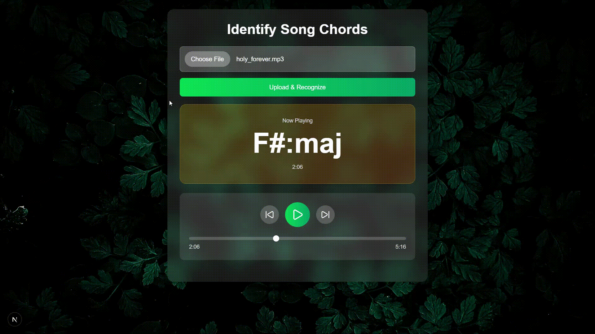

# identify-song-chords
Upload your offline songs (.mp3, .wav, etc.) files and get real-time chords displayed to play your fav song with!

### Used Chord Mini API
- https://www.chordmini.me/
- https://github.com/ptnghia-j/ChordMiniApp

## Live Demo

### More features coming soon like:
- Music to Lyrics with a chord on particular lyrics to play
- Downloadable lyrics with chords.
- Chord Transpose 
- Rythm Analyse and display strumming suggestions
